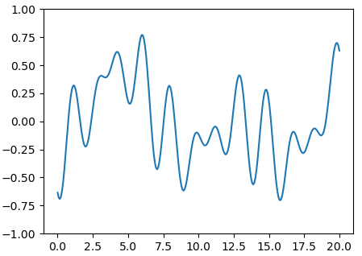

# Noise1D

## Description
One-dimensional noise with spatial consistency for C++ and Python 3. 

The C++ code is __header-only__.

This is __not__ perlin/simplex noise. It is similar to a truncated fourier series, but with aperiodicity.

## Using Noise1D in your project

__C++__

Copy `noise1d.hpp` to your project and do as in `example.cpp`.

__Python 3__

Copy `noise1d.py` to your project and do as in `example.py`.

## Plot of the curve

## License
This code is licensed under the terms of the Unlicense.